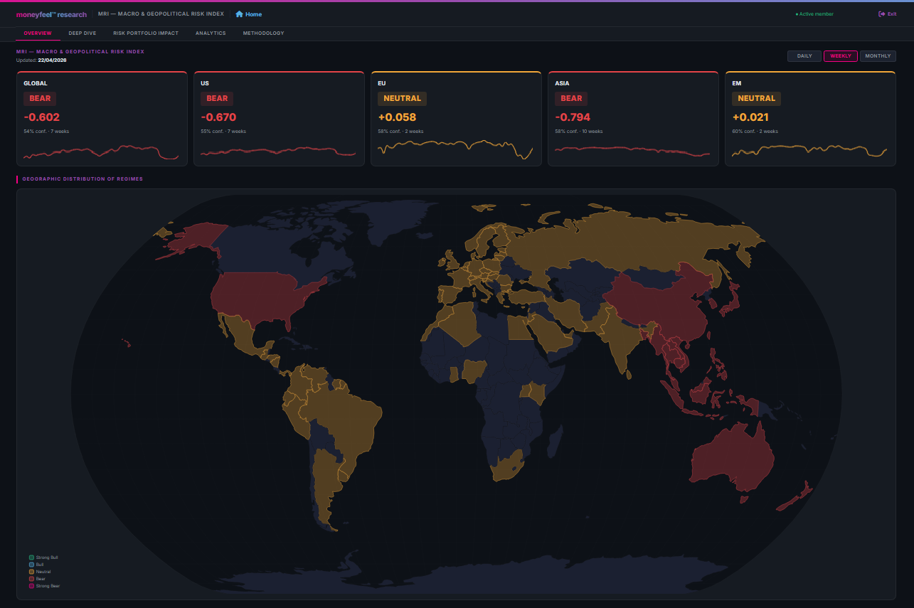

# moneyfeel Macro Risk Index — API & Documentation

> **Free REST API** for the moneyfeel **Macro & Geopolitical Risk Index (MRI)** —
> an institutional-grade market regime classifier covering **5 regions**
> (GLOBAL, US, EU, ASIA, EM) across **3 timeframes** (Daily, Weekly, Monthly),
> updated daily at market close.

[](https://api.moneyfeel.ai/v1/status)
[](https://pypi.org/project/moneyfeel-mri/)
[](https://moneyfeel.it/conto-iscrizione/)
[](#regions--timeframes)
[](./endpoints.md)
[](https://creativecommons.org/licenses/by-nc/4.0/)
[](#regions--timeframes)



---

## What this repository is

| | |
|---|---|
| ✅ | Official REST API documentation for the moneyfeel MRI |
| ✅ | Full examples in `curl`, `Python` and `R` |
| ✅ | Python client installable via `pip install moneyfeel-mri` |
| ✅ | Free access for research and non-commercial use |
| ❌ | Does NOT contain the MRI model source code |
| ❌ | Does NOT contain raw data (available via API) |

---

## What is the MRI?

The **moneyfeel Macro & Geopolitical Risk Index (MRI)** is an institutional-grade macro regime classifier covering **5 regions** (GLOBAL, US, EU, ASIA, EM) across **3 timeframes** (Daily, Weekly, Monthly), updated daily at market close.

The MRI classifies market conditions into 5 regimes:

| Regime | Equity Exposure | Description |
|---|---|---|
| `STRONG_BULL` | 100% | Strong momentum, compressed volatility |
| `BULL` | 100% | Positive macro, manageable conditions |
| `NEUTRAL` | 60% | Mixed signals, no confirmed stress (conceptually similar to 60/40). |
| `BEAR` | 0% | Elevated credit stress, rising volatility |
| `STRONG_BEAR` | 0% | Crisis conditions, extreme systemic stress |

The model processes **11 macro inputs** across 5 risk dimensions: credit markets, volatility, rate dynamics, sovereign spreads and geopolitical risk (GPR — [Iacoviello 2022](https://www.matteoiacoviello.com/gpr.htm)).

→ [Full methodology](https://moneyfeel.it/dashboard/macro-risk-index/)

---

## Python Client (PyPI)

```bash
pip install moneyfeel-mri
```

```python
from moneyfeel import MRI
client = MRI("mf_live_YOUR_KEY")
df = client.history_df("US", "WEEKLY", from_date="2020-01-01")
```

→ [Full PyPI documentation](https://pypi.org/project/moneyfeel-mri/)

---

## Quick Start

```bash
# 1. Get a free API key at https://moneyfeel.it/conto-iscrizione/ (free registration)

# 2. Current regime — no auth required
curl https://api.moneyfeel.ai/v1/current

# 3. Historical regime data — API key required
curl -H "Authorization: Bearer mf_live_YOUR_KEY" \
  "https://api.moneyfeel.ai/v1/history?region=US&tf=WEEKLY&from=2020-01-01"
```

```python
import requests

API_KEY = "mf_live_YOUR_KEY"
BASE    = "https://api.moneyfeel.ai/v1"

headers = {"Authorization": f"Bearer {API_KEY}"}

# Current regime
current = requests.get(f"{BASE}/current").json()

# US Weekly history from 2020
history = requests.get(
    f"{BASE}/history",
    params={"region": "US", "tf": "WEEKLY", "from": "2020-01-01"},
    headers=headers
).json()

print(history["data"][:3])
```

```r
library(httr2)

key  <- "mf_live_YOUR_KEY"
base <- "https://api.moneyfeel.ai/v1"

resp <- request(base) |>
  req_url_path_append("history") |>
  req_url_query(region = "US", tf = "WEEKLY", from = "2020-01-01") |>
  req_headers(Authorization = paste("Bearer", key)) |>
  req_perform() |>
  resp_body_json()

df <- do.call(rbind, lapply(resp$data, as.data.frame))
head(df)
```

---

## Get Your API Key

1. Register for free at [moneyfeel.it](https://moneyfeel.it)
2. Go to your [account page](https://moneyfeel.it/conto-iscrizione/)
3. Find the **MRI API Access** section
4. Click **Generate API Key**

Keys are free for all registered users. No credit card required.

---

## Base URL

```
https://api.moneyfeel.ai/v1
```

---

## Endpoints

| Method | Endpoint | Auth | Description |
|---|---|---|---|
| GET | `/v1/status` | No | Health check |
| GET | `/v1/regions` | No | Available regions & timeframes |
| GET | `/v1/current` | No | Current regime for all 5 regions |
| GET | `/v1/history` | Yes | Historical regime data |
| GET | `/v1/regime/latest` | Yes | Latest regime for region+timeframe |
| GET | `/v1/metrics` | Yes | Strategy performance KPIs |
| GET | `/v1/timeseries` | Yes | Daily strategy vs benchmark series |
| GET | `/v1/eoy` | Yes | Year-by-year returns |
| GET | `/v1/drawdowns` | Yes | Top drawdown periods |
| GET | `/v1/download` | Yes | Full CSV download |

→ [Full endpoint documentation](./endpoints.md)

---

## Regions & Timeframes

**Regions:** `GLOBAL` `US` `EU` `ASIA` `EM`

**Timeframes:** `DAILY` `WEEKLY` `MONTHLY`

**Coverage:** 2007-01-04 to present

---

## Rate Limits

| Limit | Value |
|---|---|
| Requests per minute | 30 |
| Requests per day | 2,000 |
| Historical coverage | Full (2007+) |

When limits are exceeded, the API returns HTTP `429` with a clear error message and `Retry-After` header.

→ [Rate limits documentation](./rate-limits.md)

---

## Error Codes

```json
// 401 — missing or invalid key
{"error": "invalid_api_key", "message": "API key not found or revoked..."}

// 429 — rate limit
{"error": "rate_limit_exceeded", "message": "30 requests/minute exceeded. Retry after 42 seconds.", "retry_after": 42}

// 429 — daily quota
{"error": "daily_quota_exceeded", "message": "2000 requests/day exceeded. Quota resets at 2026-04-15T00:00:00 UTC."}
```

---

## Data Attribution

If you use MRI data in research or publications, please cite:

> moneyfeel (2026). *Macro & Geopolitical Risk Index (MRI)*. moneyfeel.it. Retrieved from https://moneyfeel.it/dashboard/macro-risk-index/

The geopolitical risk component uses:

> Iacoviello, M. (2022). *Measuring Geopolitical Risk*. American Economic Review, 113(4), 1194–1225. https://www.matteoiacoviello.com/gpr.htm

---

## License

Data is provided under [CC BY-NC 4.0](https://creativecommons.org/licenses/by-nc/4.0/) — free for research and non-commercial use.

---

## Links

- 🌐 [moneyfeel](https://moneyfeel.it)
- 📊 [MRI Dashboard](https://moneyfeel.it/dashboard/macro-risk-index/)
- 📖 [Methodology](https://moneyfeel.it/dashboard/macro-risk-index/)
- 🔑 [Get API Key](https://moneyfeel.it/conto-iscrizione/)
- 📦 [PyPI Package](https://pypi.org/project/moneyfeel-mri/)
